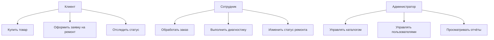

# BUC-диаграмма

```mermaid
flowchart TB
    Client[Клиент] --> UC1[Купить товар]
    Client --> UC2[Оформить заявку на ремонт]
    Client --> UC3[Отследить статус]
    Employee[Сотрудник] --> UC4[Обработать заказ]
    Employee --> UC5[Выполнить диагностику]
    Employee --> UC6[Изменить статус ремонта]
    Admin[Администратор] --> UC7[Управлять каталогом]
    Admin --> UC8[Управлять пользователями]
    Admin --> UC9[Просматривать отчёты]
```

**Студент:** Хизриев Магомед-Салах Алиевич

**Группа:** ПИЖ-б-о-23-2
