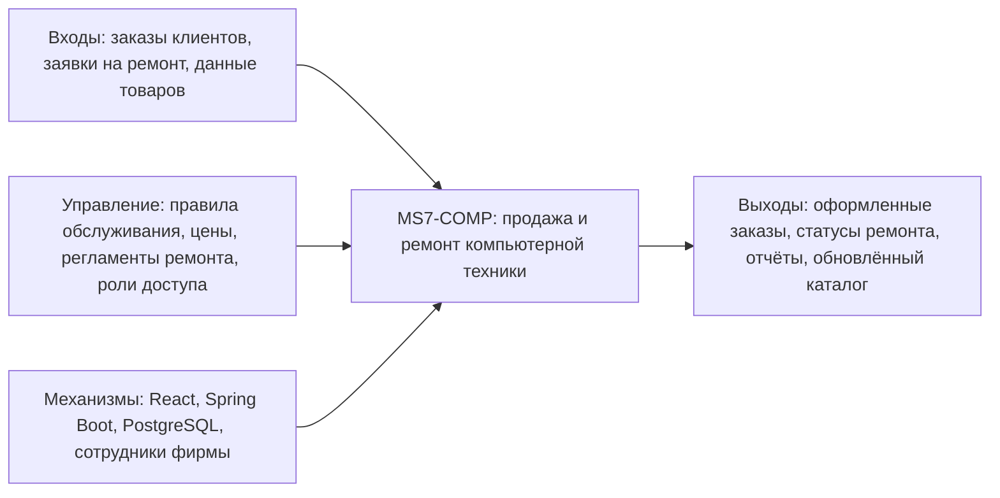

# IDEF0 A-0: Бизнес-контекст MS7-COMP

## Описание

Диаграмма показывает систему как единый бизнес-процесс. На вход поступают обращения клиентов, выбранные товары и сведения о неисправных устройствах. Управляющими воздействиями являются правила продажи, регламенты ремонта и политики безопасности. Механизмами выступают веб-приложение, серверная часть, база данных и сотрудники фирмы.

**Студент:** Хизриев Магомед-Салах Алиевич

**Группа:** ПИЖ-б-о-23-2
