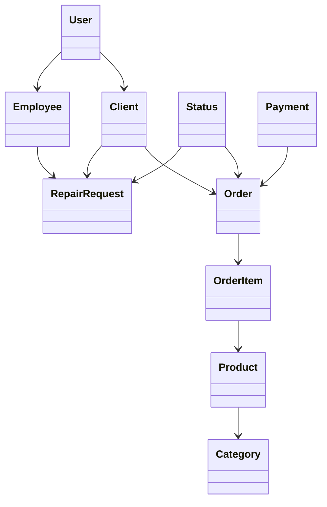

# Domain Model

## Основные правила предметной области

- Пользователь имеет одну роль: CLIENT, EMPLOYEE или ADMIN.
- Клиент может создать несколько заказов и ремонтных заявок.
- Заказ содержит не менее одной позиции.
- Товар относится к одной категории.
- Ремонтная заявка создаётся со статусом «Принята».
- Сотрудник может изменить статус заявки только после авторизации.
- Администратор имеет доступ к управлению справочниками.

**Студент:** Хизриев Магомед-Салах Алиевич

**Группа:** ПИЖ-б-о-23-2
