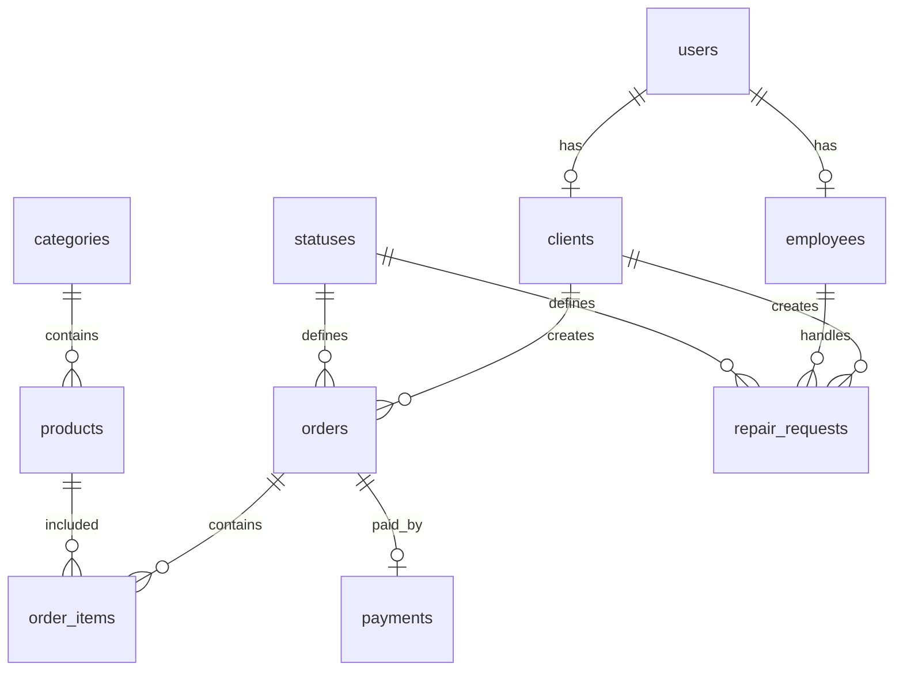

# Этап 3: Проектирование базы данных

## ER-модель

## Таблицы

- users — учётные записи
- clients — клиенты
- employees — сотрудники
- categories — категории товаров
- products — товары
- statuses — статусы заказов и ремонта
- orders — заказы
- order_items — позиции заказа
- repair_requests — заявки на ремонт
- payments — оплаты

DDL-скрипт расположен в файле [ddl.sql](ddl.sql).

**Студент:** Хизриев Магомед-Салах Алиевич

**Группа:** ПИЖ-б-о-23-2
