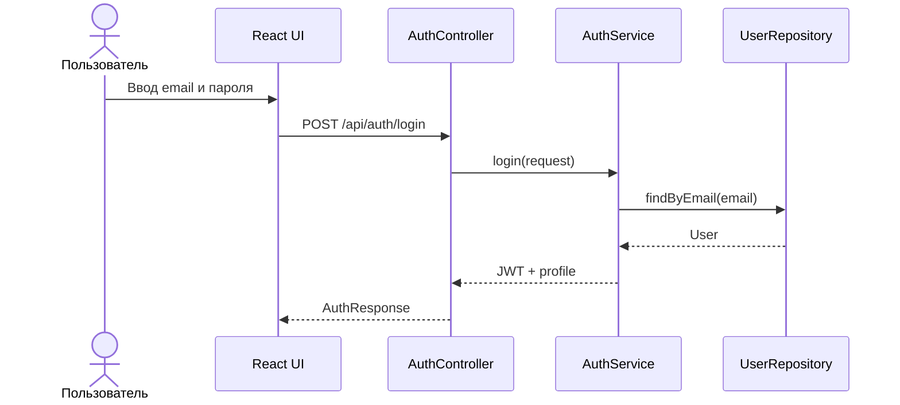
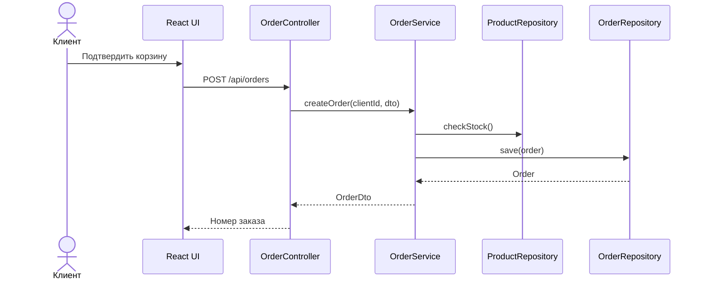
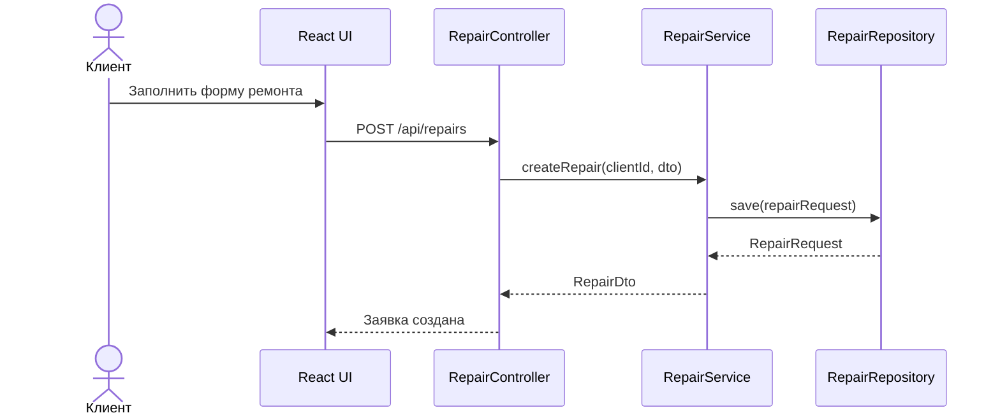
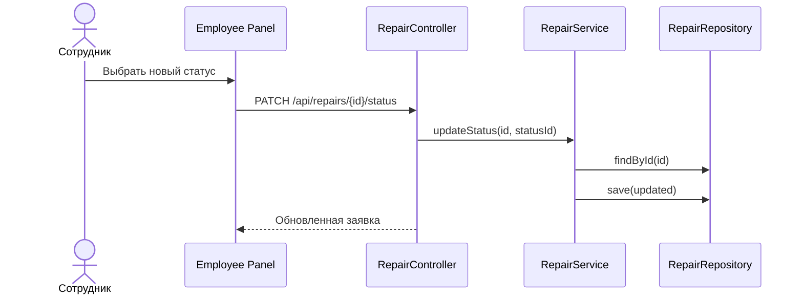

# Диаграммы последовательности

## SD-01 Авторизация

## SD-02 Оформление заказа

## SD-03 Создание заявки на ремонт

## SD-04 Изменение статуса ремонта

**Студент:** Хизриев Магомед-Салах Алиевич

**Группа:** ПИЖ-б-о-23-2
